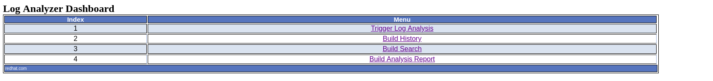
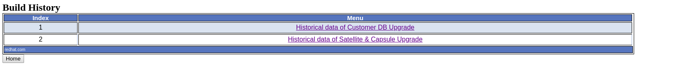

# log_analyzer_tool

Log Analyzer tool analyzes and keeps the build log in such a manner that helps to catch the error, warning, alert, commands execution status and publish the result in build history.

The job record stores in the collection base database and will be available to analyze the stability of the job.

The landing page of the log_analyzer tool is "Log Analyzer Dashboard", and it has divided into the below-mentioned options.

To do the analysis we click on Trigger Log Analyzer and it opens the "Log Analysis Menu" page where we provide the ask information and after that

click on the submit button and wait for the "Analysis" to be completed.

To check the current record or any past analyzed record click on the build history and it will help you get the analyzed record

