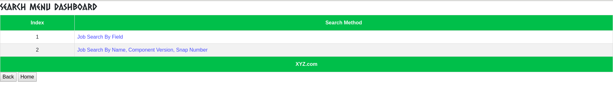

# Log Analyzer Tool

Log Analyzer tool helps to analyze the log based on the provided information like the job type(unique token), job_name(build job),
component_version, snap number, and checks on the target machine, we pick all these data from the pre-defined values [validation_parameter.sample](https://github.com/devendra104/log_analyzer_tool/tree/master/dashboard/config/validation_parameter.sample),
if someone wants to add a new job then they need to update validation the [validation_parameter.sample](https://github.com/devendra104/log_analyzer_tool/tree/master/dashboard/config/validation_parameter.sample) file using the predefined format.

This tool collects the logs from the Jenkins job and performs the analysis by taking the help of the earlier observations, all the observation
related data stores in the Mongo DB database [observation_db_name](https://github.com/devendra104/log_analyzer_tool/tree/master/dashboard/config/environment_setup.yaml),  we can also update the observation if we found something suspicious or expected after the analysis.
For observation related changes we need to go on the "Build History" then select the respective job, here we get the list of the build job we click
the data_update button for the suspicious build, and update the record by inserting the data in the dictionary format ({"Error": "Observation"}).
All the configuration related data available in the [environment_setup.yaml](https://github.com/devendra104/log_analyzer_tool/tree/master/dashboard/config/environment_setup.yaml) file,

This tool especially works with Jenkins build job. There is a number of features inside this tool, like updating the observation based on the available data, search the common error, delete the record, generate the trends based on their release version, etc, All these details are described below.

The landing page of the log_analyzer tool is "Log Analyzer Dashboard", and it has divided into the below-mentioned options.

To do the analysis we click on Trigger Log Analyzer and it opens the "Log Analysis Menu" page where we provide the ask information and after that

We click on the submit button and wait for the "Analysis" to be completed.

To check the current record or any past analyzed record click on the build history and it will help you to get the analyzed record

Click on any record we get the analysis data and if you have any observation then click on the data update link you get other page where you can submit your observation.

To search the record click on Build Search where we provide 1 option,

   **1:** This method use to search a very specific job by providing the name of job, build number and component version.

   

To check the all past error and the observations click on "Error Collection and Their Observation" button, here we keep all the past observation.

The last option is for build the analysis report, The purpose of this option is to create the analysis report and share it with the respective team member.

**Pre-requisite:**

   **1:** If you wants to setup this tool on your environment, you have to go into config directory and update the details as per you environment.

   **2:** If you wants to add new job then enter the details in to config/validation_parameter.yaml file, the structure is like below.

    jenkins_job_details:
      job1_1:
        job_name: "XYZ"
        check_on_build_environement:
          upgrade_satellite_rpm: "rpm -q xyz"
          upgrade_status_check: "foreman-maintain upgrade check
          --target-version `foreman-maintain upgrade list-versions`|grep -w 'FAIL'|
          awk '{print $NF}'|wc -l"
          upgrade_version: "foreman-maintain upgrade list-versions"
          services_status: "if [ `hammer ping|grep Status|
            awk '/Status:/{gsub(/Status:/,//);print}'|uniq|wc -l` == 1 ];
            then echo 'Hammer Ping Status is OK' ;else echo 'Hammer Ping Status Failed';fi"
        test_execution_record: ""
        keyword_availability:
          - "create_openstack_instance"
          - "INFO:upgrade_logging:SUCCESS"
          - "ansible-playbook -i inventory satellite-clone-playbook.yml"
          - "Upgrade Step: migrate_pulp..."
          - "Upgrade Step: migrate_candlepin..."
          - "Upgrade Step: migrate_foreman..."
          - "Upgrade Step: Running installer..."
        pattern_to_pattern_filter:
          pattern1: "ansible-playbook -i inventory satellite-clone-playbook.yml"
          pattern2: "PLAY RECAP *"
        highlited_upgrade_content: ""

   **3:** If you wants to do the analysis on the build machine, then you have to update the regex that fetched the build machine details of your job in machine_detail.sample.

    machine_detail:
        satellite6_db_upgrade_migrate: "awk '/The registered system name/ {print $NF}'"
        upgrade-to-<component-version>-rhel7: "awk '/The registered system name/ {print $NF}'"

**How to run:**

   **1:** Create a virtual environment

      virtualenv -p python3.6 app_pyenv

   **2:** source app_pyenv/bin/activate

   **3:** pip install -r requirements.txt

   **4:** Execute python rest_services.py

       $ python rest_service.py
         * Serving Flask app "views.pagination_support" (lazy loading)
         * Environment: production
           WARNING: This is a development server. Do not use it in a production deployment.
           Use a production WSGI server instead.
         * Debug mode: off
         * Running on http://0.0.0.0:5001/ (Press CTRL+C to quit)

**How to Update the Observation**

   **1:** The  Observation data should be proper dictionary and for now we are not supporting character inside observation keys like (.\))

        {"Time taken by task Repository Red Hat Enterprise Linux 7 Server RPMs x86_64 7Server sync": "BZ#1787282(not used workaround for 6.6)}

**Helper**

   **1:** We have used tooltip to provide the help to understand the meaning of options whether it is input form or output results.
        

**Deployment on Docker container**

   **1:** Install docker on linux machine.

   **2:** Clone the log_analyzer repository on docker server.

   **3:** Check the environment_setup.yaml file and configured it according to your requirement.

      config:
        data_location: "downloaded_data"
        report_location: "report"
        logger_file_name: "loganalysis.log"
        per_page: 5
        jenkins_username: "encrypted username"
          jenkins_password: "encrypted password"
          jenkins_key: "keys to decrypt users credentials"
          database_name: "analysis_record_db"
          observation_db_name: "observation_record_db"
          mongodb_container: "mongodb"
          build_server_hostname: "xyz.com"
          build_server_pemfile: "id_rsa"
          mail_script_name: "mail_content.sh"
          mail_script_location: "/root"
          mongodb_port: 27017
          build_machine_username: "root"
          build_machine_password:
            - "dog8code"
            - "password2"
            - "password3"
          jenkins_base_url: "https://xyz.com"
          analysis_input_file: "build.xls"
          analysis_output_file: "report.xls"
          unsupported_path:
            - "/home"
            - "/usr"
            - "/bin"
            - "/temp"
            - "/"
          test_map:
            - "automation-preupgrade"
            - "automation-postupgrade"

   **4:** Pull the mentioned version of mongodb like below.

        docker pull mongo:4.2.0

   **5** Create the image of log analyzer tool by executing below command

        docker build --tag dashboard_web --network=host .

   **6** After that execute the docker-compose command

        docker-compose up -d
   **7** mail server should be configured on host machine and copy the "mail_content.sh" script from repository to root directory.

        cp log_analyzer_tool/dashboard/mail_content.sh /root/mail_content.sh
