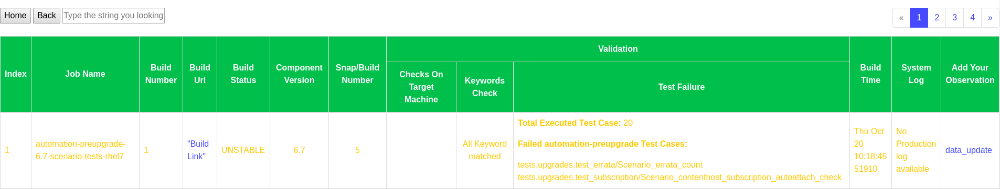

# Log Analyzer Tool

Log Analyzer tool, Analyze the build log using pre-defined log parser and keep the analysis data in such a manner that helps further analysis. The record stores in the collection base database and will be available always to analyze the stability of the job.

We provide the functionality to update the observation, and keeping all these observations in a separate database so whenever a new analysis trigger
we check the error, whether it occurs in the past or not at run time, If it occurred in the past then we update the record at the same time.

The purpose of this tool to reduce the manual effort, maintain the record of all possible suspicious messages and their observation in a database
which will help us in the future to compare the data.

As we all know, It is very hard to memorize all the suspicious messages and observations, gradually these things get starts to disappear and after few months we don't know what this message means,
Is it kind of bug or something expected, In this case, this tool will be very helpful.

The landing page of the log_analyzer tool is "Log Analyzer Dashboard", and it has divided into the below-mentioned options.

To do the analysis we click on Trigger Log Analyzer and it opens the "Log Analysis Menu" page where we provide the ask information and after that

click on the submit button and wait for the "Analysis" to be completed.

To check the current record or any past analyzed record click on the build history and it will help you get the analyzed record

Click on any record we get the analysis data and if you any observation then click on data update link you get other page where you can submit your observation. 

To search the record click on Build Search where we provide two option

   **1:** The first one for search data via field(like job_name, build number, build status, component version and their snap version).
    
   
 
   **2:** The second one use to search a very specific job by providing the name of job, build number and component version.

   

To check the all past error and the observation click on Error Collection and Their Observation button, here we keep all the past observation.

**Pre-requisite:**

   **1:** If you wants to setup this tool on your environment, you have to go into config directory and update the details as per you environment.

   **2:** If you wants to add new job then enter the details in to config/validation_parameter.yaml file, the structure is like below.

    jenkins_job_details:
      job1_1:
        job_name: "XYZ"
        check_on_build_environement:
          upgrade_satellite_rpm: "rpm -q xyz"
          upgrade_status_check: "foreman-maintain upgrade check
          --target-version `foreman-maintain upgrade list-versions`|grep -w 'FAIL'|
          awk '{print $NF}'|wc -l"
          upgrade_version: "foreman-maintain upgrade list-versions"
          services_status: "if [ `hammer ping|grep Status|
            awk '/Status:/{gsub(/Status:/,//);print}'|uniq|wc -l` == 1 ];
            then echo 'Hammer Ping Status is OK' ;else echo 'Hammer Ping Status Failed';fi"
        test_execution_record: ""
        keyword_availability:
          - "create_openstack_instance"
          - "INFO:upgrade_logging:SUCCESS"
          - "ansible-playbook -i inventory satellite-clone-playbook.yml"
          - "Upgrade Step: migrate_pulp..."
          - "Upgrade Step: migrate_candlepin..."
          - "Upgrade Step: migrate_foreman..."
          - "Upgrade Step: Running installer..."
        pattern_to_pattern_filter:
          pattern1: "ansible-playbook -i inventory satellite-clone-playbook.yml"
          pattern2: "PLAY RECAP *"
        highlited_upgrade_content: ""

   **3:** If you wants to update the machine details search regex from build log then update it in machine_detail.sample 

**How to run:**

   **1:** Create a virtual environment 

      virtualenv -p python3.6 app_pyenv
      
   **2:** source app_pyenv/bin/activate
   
   **3:** pip install -r requirements.txt
   
   **4:** Execute python rest_services.py

       $ python rest_service.py 
         * Serving Flask app "views.pagination_support" (lazy loading)
         * Environment: production
           WARNING: This is a development server. Do not use it in a production deployment.
           Use a production WSGI server instead.
         * Debug mode: off
         * Running on http://0.0.0.0:5001/ (Press CTRL+C to quit)
   

